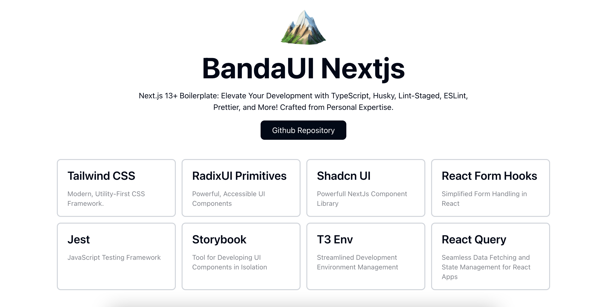

# 🏔 BandaUI Next.js

A feature-packed Next.js 13+ boilerplate designed to supercharge your development workflow. Crafted with inspiration from Shadcn UI, this boilerplate comes equipped with a powerful toolkit of packages to simplify your development process.



## :rocket: Features

- 🔥 [Next.js](https://nextjs.org) 13+ App Router
- ⚛ [React 18](https://react.dev/blog/2022/03/29/react-v18)
- 📝 [TypeScript](https://www.typescriptlang.org) - Type checking
- 🌬 [Tailwind CSS](https://tailwindcss.com) - Modern, Utility-First CSS Framework
- 📏 [ESLint](https://eslint.org) - Find and fix problems code
- 💄 [Prettier](https://prettier.io) - Code Formatter for consistently
- 🐶 [Husky](https://typicode.github.io/husky/#/) for Git Hooks
- 🦺 [Lint-staged](https://github.com/okonet/lint-staged) - Running linters on Git staged files
- 📖 [Conventional Commit Lint](https://www.conventionalcommits.org) - Make sure your commit is informatif

## ⏳ On Progress

- 👮‍♀️ [T3 env](https://env.t3.gg/) - Manage your environment variables with ease
- 🧪 [Jest](https://jestjs.io/) - Unit testing

## ℹ️ How To Use

### 1. Clone this template

To use this template you can simply click in **[Use this template](https://github.com/FUA26/banda-ui-nextjs)** or create your Next.js app based on this template by running:

```bash
npm create next-app -e https://github.com/FUA26/banda-ui-nextjs
```

### 2. Install dependencies

Make sure you on the correct directory

```bash
npm install
```

### 3. Run on your local

Start your project with command:

```bash
npm run dev
```

Made with :heart: and :muscle: by Fatih Ulil Albab <a href="https://www.linkedin.com/in/fatih-ulil-albab/">My Contact</a>
